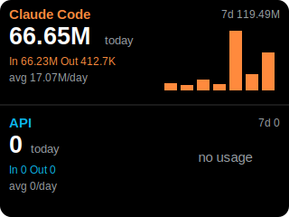

# Vobot Claude Usage

Show your **Claude token usage** live on a [Vobot Mini Dock](https://dock.myvobot.com/) —
**Claude Code / Cowork** (subscription) and the **metered API** — with today's tokens,
an In/Out split, a 7 / 14 / 30‑day total + average, and a daily bar chart.

> ⚠️ **Not affiliated with or endorsed by Anthropic or Vobot.** "Claude" is a trademark of
> Anthropic, "Vobot" of its respective owner. You use your own account, logs, and API keys.

<p align="center">
  
</p>

<sub>Mock-up of the on-device layout. A browser version is in [`preview/index.html`](preview/index.html); a real device photo is welcome — drop one into `docs/` and link it here.</sub>

---

## Why two sources?

This is the key insight the project is built around:

- **Subscription usage** (Claude Code, Cowork, claude.ai on Pro/Max) runs through your **plan**,
  **not** the metered API — so it does **not** appear in Anthropic's Usage & Cost Admin API.
  It *is* written to local transcript logs (`~/.claude/projects/**/*.jsonl`).
- **Metered API usage** (pay‑as‑you‑go API keys) **does** appear in the Admin API.

So the dashboard reads each from where it actually lives: a small **Mac companion** parses the
local Claude Code logs, and the dock reads the **Admin API** directly for metered usage. Either
panel can be hidden by leaving its setting empty (subscription‑only users typically leave the
Admin key blank → full‑screen Claude Code view).

---

## Repository layout

| Folder | Runs on | What it does |
|---|---|---|
| [`claude_usage/`](claude_usage/) | the **dock** (MicroPython + LVGL) | The app. Copy this folder into the dock's `apps/`. |
| [`mac_companion/`](mac_companion/) | your **Mac** (same LAN as the dock) | Serves Claude Code usage from local logs. Double‑click installers included. |
| [`cloud_hub/`](cloud_hub/) | a **VPS / always‑on host** + each machine | For Claude Code across **multiple computers / networks**: each machine pushes to one hub the dock reads. |
| [`preview/`](preview/) | a **browser** | Static design mock of the 320×240 screen. Not used by the device. |

Pick **one** source for the Claude Code panel: `mac_companion` (single machine, same LAN) **or**
`cloud_hub` (multiple machines / networks).

---

## Quick start

1. **Install the dock app:** enable Developer Mode on the dock, connect via USB‑C, and use
   [Thonny](https://thonny.org/) → *View → Files* to upload the **`claude_usage`** folder into the
   device's `apps/` directory, then press `Ctrl+D`. (See [`claude_usage/README.md`](claude_usage/README.md).)
2. **Claude Code panel (single machine):** double‑click
   `mac_companion/Install Background Service.command` to run the companion in the background. Note the
   printed `http://<your-mac-ip>:8787/usage` URL. (See [`mac_companion/README.md`](mac_companion/README.md).)
3. **Configure the dock:** open `http://<DOCK-IP>/apps` → **Claude Usage**, set **Claude Code helper URL**
   to the companion URL. Leave **Anthropic Admin API key** empty for subscription‑only, or add an
   `sk-ant-admin…` key (organizations only) to also show the API panel.

---

## How it works

```
 ┌───────────────────────────┐        Wi‑Fi/HTTP         ┌──────────────────────┐
 │ Mac companion             │ ───────────────────────▶ │ Vobot Mini Dock app  │
 │ reads ~/.claude logs      │   GET /usage (JSON)       │  ┌────────────────┐  │
 │ → daily token totals      │                           │  │ Claude Code    │  │
 └───────────────────────────┘                           │  ├────────────────┤  │
 ┌───────────────────────────┐   GET usage_report        │  │ API            │  │
 │ Anthropic Admin API       │ ◀──────────────────────── │  └────────────────┘  │
 │ (metered API usage)       │   (sk-ant-admin… key)     └──────────────────────┘
 └───────────────────────────┘
```

- The dock app polls each source every ~10 minutes and renders one or two panels.
- Token counts are read **only as numbers** (input/output per day) — no conversation content.
- See [`claude_usage/README.md`](claude_usage/README.md) for settings and troubleshooting.

---

## Requirements

- A Vobot Mini Dock (firmware ≥ 1.1.0) on Wi‑Fi.
- For the Claude Code panel: a Mac that runs Claude Code, with Python 3 (preinstalled), on the same
  network as the dock (or a reachable hub for the multi‑machine setup).
- For the API panel: an Anthropic **Admin API key** (`sk-ant-admin…`, organizations only — not
  available for individual API accounts).

---

## License

[MIT](LICENSE)
